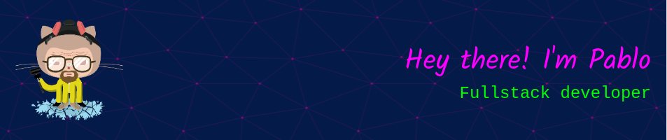

<header>
  
</header>

 Here you can find me: 

  
  

 

 

  

 

<h2>Technologies & Tools</h2>

|                          | Stacks                                                                                | Description                          |
| ------------------------ | ------------------------------------------------------------------------------------- | ------------------------------------ |
| **Highlighter**          |  | HTML, Markdown                       |
| **Styles**               |            | Css, StyledComponents, Material-UI   |
| **languages**            |                               | JavaScript, TypeScript, Python       |
| **Frameworks/Libraries** |          | React, Redux, nodeJs, Express, Flask |
| **SQL/NoSQL**            |                           | Postgres, MongoDb                    |
| **Tools**                |                     | Docker, Git, Bash, Github            |
| **Deploy**               |                              | Heroku, Vercel                       |
| **Mockups**              |                                      | Figma                                |
| **O.S.**                 |                                       | Linux                                |

  

